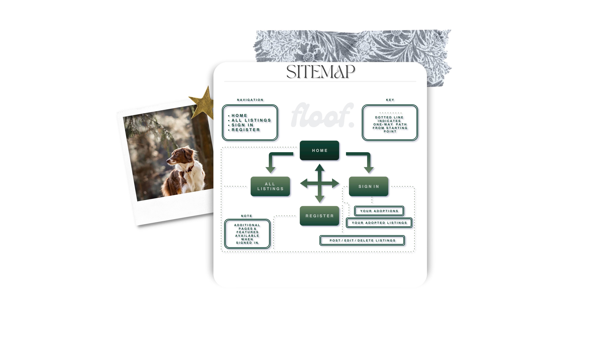
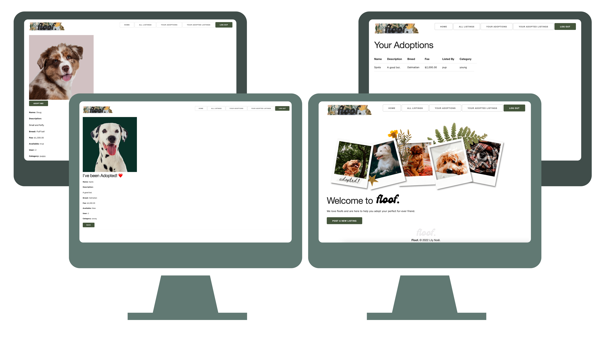
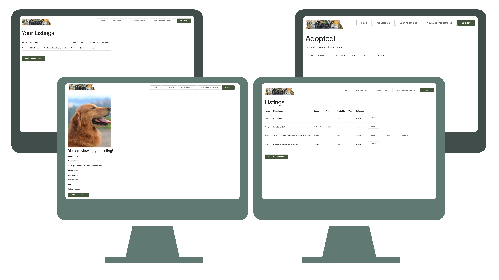
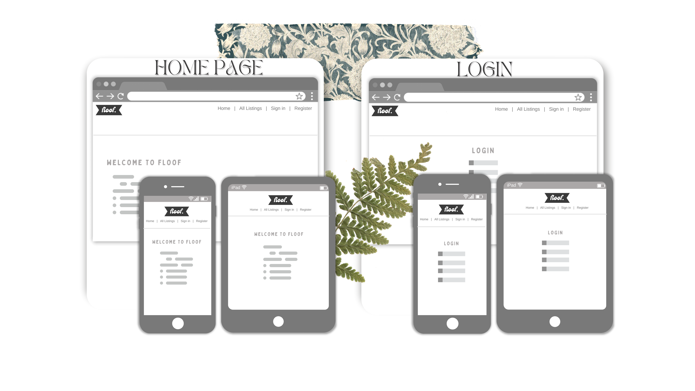
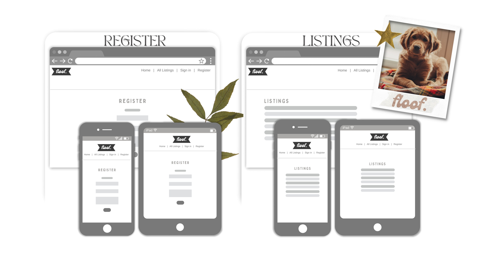
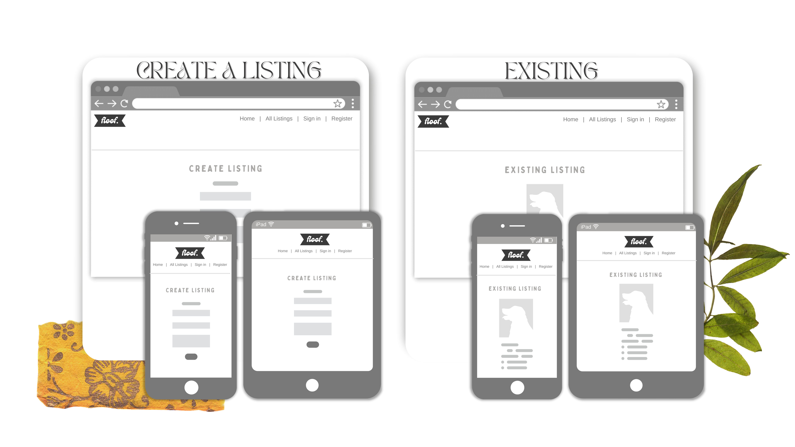

<h1 align="center"> 

Lily Noël • T2A2 Marketplace Project 

</h1>

<!-- logo -->

<h5 align="center">

</h5>

## Application Name
- Floof.

## Deployed App

- [Lily Noël - T2A2 <b>Floof.</b> Marketplace App | Heroku ](https://staging-floof.herokuapp.com/)

## GitHub Repo
- [Lily Noël - T2A2 | GitHub Repository](https://github.com/lilynoel/T2A2)

 

## App Summary

Floof is an adoption app specific to canines that is geared towards those who are hoping to help animals in need find a forever home while also finding a fur buddy to welcome into their home and family as a permanent placement. 

## What is the problem and why does it need solving?
There are so many dogs out there in need of love, shelter, food, warmth - home. On the same note, there are also many humans out there looking for a forever pal. Floof serves to address this issue.

## Description of your marketplace app (website), including:

- <b>Purpose</b>
  The primary purpose of this application, is to bridge the gap between dogs who need a home, and humans who need a dog in their life. Adoption is an ethical, compassionate solution to this problem. Getting pups off the street, and allowing humans to experience the unconditional love of a dog. Floof is a mutually beneficial two sided marketplace application created with this problem in mind. 
 

- <b>Functionality & features</b>
  As a two sided marketplace application, Floof's functionality supports both "buys & sellers" or specific to Floof: adopters and listing authors. The functionality varies depending on whether or not the user is logged in:

  - <b>Guest user</b>

     - Navigate between home page and view other users listings only. 
     - If guest / visitor tries to post a new listing, they will be redirected to the login page. Listings are protected from guests / visitors. No action can be taken, only viewing and registering / logging in.

  - <b>Registered user</b>

      - Register with floof / create a profile (multiple users supported)
      - Login / logout 
      - Post, edit, view & delete own listings
      - View other users listings
      - "Adopt a dog" from another user's listing
      - Listing will automatically update once posted dog has been adopted
      - View a list of all listings
      - View a list of own <i>inactive</i> listings that have been adopted
      - View a list of listings user has adopted.
      - Users can enjoy peace of mind knowing that their listings cannot be edited or deleted by other users. 
      - Listings support image upload feature. 
  
 

- <b>Target audience</b>
  - Floof was created for those wishing to adopt a dog in need of a home. 
 

- <b>Tech stack</b>
  - This application was built using Rails 6.1.6, Ruby 2.7.5, JavaScript, HTML & CSS. The database used is PostgresQL and the app was deployed with Heroku. Images were hosted using Wix & ImgBB.

## Sitemap

## Screenshots

## User stories

In the context of the Floof application, buyers will be referred to as adopters, and sellers will be known as listing author. The term users may be used to refer to either of the two. 

   - <b>Guest user</b>
      - As a guest or visitor to the Floof web application, I'd like to have the option of navigating the site seamlessly, have an understanding of what the application does / it's purpose and experience some of the app's features such as viewing a listing.

      - The option to sign up / register is important as a guest or visitor to the application. If I enjoy my preliminary experience of the application, and it aligns with my needs I will then expect the capability of registering to the application's services. 
  
   - <b>Listing author</b>
     - As a registered user, I'd like to be able to view other users listings.
     - As a registered user, its important that I can post, edit, delete and view my listings and that no one else can access those features on my listings beyond viewing and adopting.
     - As a registered user, it would be nice to have the option to view all of my successfully adopted listings in one place.
     - As a registered user, it would be very helpful to view a list of dogs I have adopted. 
     - As a registered user its very important that I can login and logout of this application. 
     - As a registered user, in addition to the features listed above, i'd like to have access to adopting dogs via the listings page and that those listings are automatically updated to reflect the dog has been adopted. 

 

## Wireframes 

## ERD

## Explain the different high-level components (abstractions) in your app

- <b>Forms</b>
  - Forms are used in a number of places on the website mainly for signing up and to sign in,  Although you do not need this component to brows the sites listings you do need it to make a new listing. Forms are styled in a similar way to the tables component.

- <b>Tables</b>
  - Tables display the listing information throughout the website on the listings, your adoptions, and your adopted listing pages. This is an effective way of formatting information because it is clear and to the point.

- <b>Nav Bar</b>
  - The navbar is displayed on every page, and allows users to navigate the website. This is by far the most used feature and you don't need to be signed in to use it.
 

## Detail any third party services that your app will use

- <b> Github |</b> Source control.

- <b> Heroku |</b> Deployment.

- <b> PostGresQL |</b> Database.

- <b> Rspec |</b> Testing.

- <b> Devise |</b> User authentication.

- <b> Wix & ImgBB |</b> Cloud based image hosting.
 

## Describe your projects models in terms of the relationships (active record associations) they have with each other

- This application uses the following models: <i>users, buyers, categories, listings.</i> The users model is made up of a person's email, username and passwords. The users model is connected to buyer_id and seller_id by the zero or many relation.

- <b>Users model</b>
  - The users model is referenced with its user_id by the Adoption and listings models for both buyer and sellers. A user can have many listings, sold orders and bought orders. On the ERD diagram it is shown as has _many specifies to one to many association. 

- <b>Categories</b>
  - Categories reference the category_id.

- <b>Listings</b>
  - Listings reference the user_id and category_id they specify a one to one association. For this case the listing belongs to a specific user and a category.

- <b>Buyers (Adoption)</b>
  - Buyers specify a one to one association with another class. A buyer_id belongs to the listing, a buyer and a seller and this creates a foreign key for buyers and sellers from the user class. This table contains information about listings that have been sold or "adopted".
 

## Discuss the database relations to be implemented in your application

- <b>Users</b>
  - Users can create no or many listings and an optional to many relationship with the listings and adoption tables.

- <b>Listings</b>
  - The Listing table displays two foreign keys, user_id and category_id. When a user creates a listing it belongs only to that user because listings have a one to one relationship with users. Listings have an optional to one relationship with categories and the adoption tables.

- <b>Categories</b>
  - Categories can belong to none or many listings and are shown to have an optional to many relationship with the listings table.

- <b>Adoption</b>
  - This table is shown to have a one to one relationship with users. a Buyer can belong to only one user and listing. The Adoption table list the following foreign keys listing id, buyer id and seller id.

- <b>Active storage</b> 
  - The active storage table has a one to one relationship with the listings, users and Blobs table. The only foreign key in active storage is record id.

- <b>Active storage blobs</b>
  - This table shares a one to one relationship with active storage.
 

## Provide your database schema design

    ActiveRecord::Schema.define(version: 2022_07_21_064811) do

These are extensions that must be enabled in order to support this database enable_extension "plpgsql"

        create_table "action_text_rich_texts", force: :cascade do |t|
            t.string "name", null: false
            t.text "body"
            t.string "record_type", null: false
            t.bigint "record_id", null: false
            t.datetime "created_at", precision: 6, null: false
            t.datetime "updated_at", precision: 6, null: false
            t.index ["record_type", "record_id", "name"], name: "index_action_text_rich_texts_uniqueness", unique: true
        end

        create_table "active_storage_attachments", force: :cascade do |t|
            t.string "name", null: false
            t.string "record_type", null: false
            t.bigint "record_id", null: false
            t.bigint "blob_id", null: false
            t.datetime "created_at", null: false
            t.index ["blob_id"], name: "index_active_storage_attachments_on_blob_id"
            t.index ["record_type", "record_id", "name", "blob_id"], name: "index_active_storage_attachments_uniqueness", unique: true
        end

        create_table "active_storage_blobs", force: :cascade do |t|
            t.string "key", null: false
            t.string "filename", null: false
            t.string "content_type"
            t.text "metadata"
            t.string "service_name", null: false
            t.bigint "byte_size", null: false
            t.string "checksum", null: false
            t.datetime "created_at", null: false
            t.index ["key"], name: "index_active_storage_blobs_on_key", unique: true
        end

        create_table "active_storage_variant_records", force: :cascade do |t|
            t.bigint "blob_id", null: false
            t.string "variation_digest", null: false
            t.index ["blob_id", "variation_digest"], name: "index_active_storage_variant_records_uniqueness", unique: true
        end

        create_table "categories", force: :cascade do |t|
            t.string "name"
            t.datetime "created_at", precision: 6, null: false
            t.datetime "updated_at", precision: 6, null: false
        end

        create_table "listings", force: :cascade do |t|
            t.string "name"
            t.string "breed"
            t.string "location"
            t.integer "fee"
            t.boolean "available", default: true
            t.datetime "created_at", precision: 6, null: false
            t.datetime "updated_at", precision: 6, null: false
            t.bigint "user_id"
            t.bigint "category_id"
            t.index ["category_id"], name: "index_listings_on_category_id"
            t.index ["user_id"], name: "index_listings_on_user_id"
        end

        create_table "orders", force: :cascade do |t|
            t.bigint "listing_id", null: false
            t.bigint "buyer_id", null: false
            t.bigint "seller_id", null: false
            t.datetime "created_at", precision: 6, null: false
            t.datetime "updated_at", precision: 6, null: false
            t.index ["buyer_id"], name: "index_orders_on_buyer_id"
            t.index ["listing_id"], name: "index_orders_on_listing_id"
            t.index ["seller_id"], name: "index_orders_on_seller_id"
        end

        create_table "users", force: :cascade do |t|
            t.string "email", default: "", null: false
            t.string "encrypted_password", default: "", null: false
            t.string "reset_password_token"
            t.datetime "reset_password_sent_at"
            t.datetime "remember_created_at"
            t.string "username"
            t.datetime "created_at", precision: 6, null: false
            t.datetime "updated_at", precision: 6, null: false
            t.index ["email"], name: "index_users_on_email", unique: true
            t.index ["reset_password_token"], name: "index_users_on_reset_password_token", unique: true
        end

        add_foreign_key "active_storage_attachments", "active_storage_blobs", column: "blob_id"
        add_foreign_key "active_storage_variant_records", "active_storage_blobs", column: "blob_id"
        add_foreign_key "orders", "listings"
        add_foreign_key "orders", "users", column: "buyer_id"
        add_foreign_key "orders", "users", column: "seller_id"
        end

 

## Describe the way tasks are allocated and tracked in your project 

- During the development of my application I utilized Trello to track my tasks and workflow. I labelled the tasks based on priority, and any issues I was having were labelled based on progress. 

- As tasks were completed, they were moved to different cards on the board for example, an incomplete task might be in 'To-Do' or "Working On It' per the screenshot provided. Once a task was finished, it was then moved to "Done". This helped me to keep track of which tasks or errors were outstanding and the status. This ensured a seamless workflow and that all tasks were completed.

#

<h5 align="center">

Floof. © 2022 Lily Noël.

</h5>
